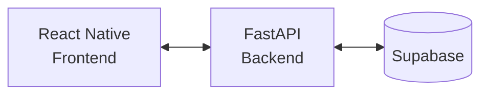

# Teto Justo


O **Teto Justo** é um aplicativo para organizar a convivência em casas
compartilhadas. A plataforma permite cadastrar casas e seus moradores, criar e
atribuir tarefas, além de acompanhar as sessões e responsabilidades de cada
pessoa — tornando a divisão das atividades do lar mais clara e justa.

## Protótipo

O fluxo e as telas do aplicativo estão disponíveis no
[Figma](https://www.figma.com/design/xMTN0YQQvJrjXXuPWrQhMr/Untitled?node-id=0-1&t=9VOn0ieYSl2Ssmk3-1).

## Tecnologias

- **Frontend:** React Native, Expo, Expo Router e TypeScript. Estado global com Zustand e token de sessão guardado com Expo SecureStore no celular e `localStorage` na web (ainda sem telas que os usem).
- **Backend:** Python, FastAPI, Pydantic e Uvicorn.
- **Dados:** Supabase.
- **Qualidade:** ESLint, Prettier, Ruff, Bandit e Pytest.
- **Containerização:** Docker e Docker Compose.

## Arquitetura



O app React Native consome a API FastAPI, que concentra as regras de negócio e
acessa o Supabase para persistir os dados.

## Como rodar localmente

Para visualizar somente a tela **Nova tarefa**, siga diretamente a
[etapa 3 — Frontend](#3-inicie-o-frontend). Sem configuração da API, a tela usa
dados fictícios e não precisa de backend, Docker, Supabase ou `.env`. Com a API
configurada, a criação grava tarefas comuns no Supabase por meio do backend.
A opção rotativa permanece como prévia local e não grava rodízios.
A tela **Tarefas** consulta a API e requer a configuração abaixo.

### Pré-requisitos

- Para o frontend: Node.js e npm; o projeto utiliza Expo SDK 57;
- Para o backend: Python 3 e um projeto Supabase com as variáveis de acesso;
- Opcionalmente, Docker e Docker Compose para executar o backend em container.

### 1. Configure as variáveis de ambiente

Crie um arquivo `.env` na raiz do projeto com as credenciais do seu projeto
Supabase:

```env
SUPABASE_URL=https://seu-projeto.supabase.co
SUPABASE_KEY=sua-chave-do-supabase
```

Não versione esse arquivo nem exponha as credenciais.

Antes de iniciar o backend com um banco existente, confira quais migrations de
`docs/migrations/` já foram aplicadas. A sequência dos arquivos é `14.sql`,
`15.sql`, `16.sql`, `17.sql` e `18.sql`, respeitando as que já constam do banco.
As migrations `17.sql` e `18.sql` também contêm estruturas de rodízio que não
têm integração ativa na aplicação. Esta retirada não executa migrations.
O arquivo `19.sql` reconcilia o saldo com o histórico de eventos e deve ser
aplicado somente depois de revisar `GET /casas/{id}/auditoria-score`. Nenhuma
migration anterior deve ser editada ou reaplicada indiscriminadamente. Veja o
[resumo da sprint 2](./contexto/sprint_2/alinhamento_tarefas_pontuacao.md).

### 2. Inicie o backend

Em um terminal, execute:

```powershell
cd src/backend
python -m venv venv
.\venv\Scripts\Activate.ps1
pip install -r requirements.txt
uvicorn main:app --reload
```

A API ficará disponível em `http://127.0.0.1:8000`. Para confirmar que está
ativa, acesse `http://127.0.0.1:8000/health`.

Para o navegador em outra origem, defina `CORS_ORIGINS` no `.env` do backend
com as origens separadas por vírgula (por exemplo,
`http://localhost:8081,http://127.0.0.1:8081`).

#### Rotina agendada de penalidades

Um agendador externo pode chamar `POST /jobs/penalidades`. Configure
`PENALIDADE_JOB_TOKEN` no ambiente do backend e envie o mesmo valor no
cabeçalho `X-Penalidade-Job-Token`. Sem o segredo, o endpoint fica desativado;
não use o token em logs nem o exponha ao frontend.

Para desenvolvimento local, cada pessoa cria seu próprio token no `.env` local
da raiz do repositório; não é necessário compartilhar tokens entre
desenvolvedores. Gere um valor aleatório com Python:

```powershell
python -c "import secrets; print(secrets.token_urlsafe(32))"
```

Copie o resultado para `PENALIDADE_JOB_TOKEN` no `.env` local e reinicie o
backend. `.env.example` documenta a variável, mas seu valor real não deve ser
preenchido nem commitado. Para um ambiente compartilhado, o responsável pela
implantação deve cadastrar o mesmo segredo no armazenamento seguro de variáveis
do backend e do agendador; compartilhe o acesso pelo gerenciador de segredos da
equipe, nunca por commits, mensagens ou logs.

Um teste manual em PowerShell pode usar uma variável de ambiente já configurada
na sessão, sem gravar o valor no comando:

```powershell
Invoke-RestMethod -Method Post `
  -Uri "http://127.0.0.1:8000/jobs/penalidades" `
  -Headers @{ "X-Penalidade-Job-Token" = $env:PENALIDADE_JOB_TOKEN }
```

A rotina marca tarefas vencidas como `atrasada` e, após ultrapassar o atraso
máximo, como `nao_feito`. Chamadas repetidas são seguras: a atualização compara
o estado e as regras atuais da tarefa, e não gera `score_event` nem altera o
saldo. O desconto de `100 / (atraso_maximo + 1)` por dia é calculado no momento
da conclusão, onde o crédito é registrado uma única vez. O agendamento em si
deve ser configurado no serviço externo que fará a chamada HTTP.

Como alternativa, a partir da raiz do repositório, execute o backend com
Docker:

```powershell
docker compose up --build backend
```

### 3. Inicie o frontend

Abra um terminal na raiz da sua cópia do repositório e instale as dependências
registradas no arquivo de lock:

```sh
cd src/frontend
npm ci
```

Faça essa instalação na primeira execução ou após receber alterações nas
dependências. Execute os próximos comandos dentro de `src/frontend`.

Para carregar a tela **Tarefas** com dados reais, crie
`src/frontend/.env.local` (esse arquivo é ignorado pelo Git):

```env
EXPO_PUBLIC_API_URL=http://127.0.0.1:8000
EXPO_PUBLIC_CASA_ID=uuid-da-casa
EXPO_PUBLIC_TETO_JUSTO_TOKEN=token-de-sessao-valido
```

Use essa configuração somente no desenvolvimento local. O token não deve ser
versionado nem incorporado em builds distribuídos; o futuro fluxo de login
deve fornecer a sessão em tempo de execução. No celular, substitua
`127.0.0.1` pelo IP da máquina na rede local.

No PowerShell, se `npm` ou `npx` forem bloqueados pela política de scripts,
use `npm.cmd` e `npx.cmd`, respectivamente. No macOS e Linux, use os comandos
sem `.cmd`.

#### No navegador

```sh
npm run web -- --port 8081
```

Mantenha o terminal aberto e acesse
[Nova tarefa](http://localhost:8081/nova-tarefa), ou escolha **Criar**
na navegação do app. O formulário contém nome, descrição opcional, peso de
1 a 3 e prazo de 1 a 5 dias. Uma tarefa **Comum** tem um responsável; uma
**Rotativa** recebe pelo menos dois participantes, ordem ajustável e um ou
mais dias da semana, com repetição a cada 1, 2, 3 ou 4 semanas (por exemplo,
segunda-feira a cada 2 semanas). Quatro semanas correspondem a 28 dias,
aproximadamente um mês. Com a API configurada, **Criar tarefa** grava apenas
tarefas comuns. A opção rotativa mostra uma prévia local e não inicia um
rodízio. Sem a API, **Conferir tarefa** mostra uma prévia em memória.

Se a porta estiver ocupada, use a instância já aberta ou inicie com
`npm run web -- --port 8082` e ajuste a porta no endereço do navegador.

#### No celular com Expo Go

Instale o **Expo Go compatível com SDK 57** e conecte o celular e o computador
à mesma rede Wi-Fi. A versão pode ser consultada no
[site oficial do Expo Go](https://expo.dev/go).

Pare o servidor anterior com `Ctrl+C`, se estiver usando a mesma porta, e execute:

```sh
npx expo start --go --port 8081
```

Leia o QR code no terminal usando o Expo Go no Android ou a câmera do iPhone.
Depois de abrir o projeto, toque em **Criar**. No iPhone, entre com a
mesma conta Expo no aplicativo e na CLI, usando `npx expo login` no computador,
conforme a [orientação oficial do Expo](https://docs.expo.dev/get-started/start-developing/).

Se a rede impedir a conexão, pare o servidor e tente
`npx expo start --go --tunnel`; esse modo depende da internet e pode solicitar
suporte adicional a túnel. Use o novo QR code. `localhost` no celular aponta
para o próprio aparelho, não para o computador.

#### Compilar e instalar no aparelho

Os scripts abaixo compilam o aplicativo nativo; são uma alternativa ao Expo Go.

| Destino | Comando | Pré-requisitos |
| --- | --- | --- |
| Android | `npm run android -- --device` | Android Studio, Android SDK, Java e aparelho com depuração USB autorizada, ou emulador configurado. |
| iPhone | `npm run ios -- --device` | Mac com Xcode, aparelho preparado para desenvolvimento e assinatura configurada. Não compila localmente no Windows. |

Esses scripts executam `expo run:android` e `expo run:ios`, respectivamente.
Podem gerar pastas nativas e ajustar a configuração do projeto. Para detalhes,
consulte [compilação local no Expo](https://docs.expo.dev/guides/local-app-development/).

#### Publicar APK e IPA no GitHub Releases

O workflow em `.github/workflows/mobile-release.yml` roda quando uma tag `v*`
é enviada ao GitHub. Ele solicita ao EAS Build um APK Android e um IPA iOS
para distribuição interna e anexa ambos ao Release da mesma tag. Antes da
primeira execução, faça a configuração abaixo em `src/frontend`:

1. Defina identificadores definitivos em `app.json`: substitua
   `android.package` (`com.anonymous.frontendnative`) e adicione
   `ios.bundleIdentifier`. Depois de distribuir o app, preserve esses valores
   para que as versões seguintes sejam atualizações do mesmo aplicativo.
2. Entre na sua conta Expo e vincule o projeto com `npx eas-cli@latest init`.
   O comando registra `extra.eas.projectId` em `app.json`; versione essa
   alteração. Use uma conta Apple Developer ativa para o IPA de dispositivo.
3. Cadastre os iPhones de teste com `npx eas-cli@latest device:create`. Execute
   `npx eas-cli@latest build --platform android --profile release` e depois
   `npx eas-cli@latest build --platform ios --profile release` uma vez no
   computador. Esses comandos interativos configuram as credenciais de
   assinatura no EAS. Confirme que ambos terminam com sucesso antes de usar o
   workflow, que roda sem interação.
4. Crie um token de acesso na [conta Expo](https://expo.dev/settings/access-tokens)
   com permissão para esse projeto. Salve-o no repositório GitHub em
   **Settings → Secrets and variables → Actions** como `EXPO_TOKEN`.
5. Antes de cada versão, atualize `expo.version` em `app.json`. Depois de
   integrar essa configuração à branch principal, na raiz da sua cópia do
   repositório crie uma tag no commit desejado e envie-a, por exemplo,
   `git tag v1.0.0` e
   `git push origin v1.0.0`. Veja a execução em **Actions** e os arquivos em
   **Releases**. Para publicar uma nova versão, crie outra tag.

O IPA interno só pode ser instalado em aparelhos incluídos no perfil de
provisionamento Apple. Para distribuição ampla, use TestFlight/App Store.
O app ainda não tem login em tempo de execução: não coloque
`EXPO_PUBLIC_TETO_JUSTO_TOKEN` no EAS ou no GitHub, pois variáveis
`EXPO_PUBLIC_*` ficam legíveis no aplicativo distribuído. Até implementar o
login, as telas que exigem a API não funcionarão em um build público sem a
configuração local de desenvolvimento.

#### Ver as alterações

Salve os arquivos com o servidor ativo para atualizar a interface. Se necessário,
pressione `r` no terminal ou recarregue a página. Para limpar o cache da prévia
web, pare o servidor e execute `npm run web -- --clear`.

Depois de instalar uma versão nativa, alterações apenas em TypeScript normalmente
precisam somente de `npm start` e da abertura do app instalado. Mudanças em
dependências nativas podem exigir nova compilação. Encerre o servidor com `Ctrl+C`.

O [tutorial detalhado](./contexto/sprint_2/tutorial_execucao_frontend.md) inclui
orientações de conexão e execução no Windows. A validação em aparelhos Android
e iOS ainda está pendente; os resultados já obtidos estão no
[contexto do frontend](./contexto/sprint_2/frontend_tarefas.md).

## Contexto do projeto

A pasta [`contexto/`](./contexto/) reúne resumos técnicos organizados por
sprint. Esses documentos registram o objetivo de cada entrega, os arquivos e
comportamentos alterados, decisões importantes, validações executadas e
pendências reais.

Ao concluir uma alteração no repositório, crie ou atualize o resumo
correspondente em `contexto/sprint_N/`. Prefira um nome curto e descritivo para
o arquivo, como `autenticacao.md` ou `testes_sessao.md`, e evite incluir
credenciais ou outras informações sensíveis.

## Qualidade de código

### Backend: Ruff

O projeto usa o **Ruff** para linting e formatação do código Python. Na pasta
`src/backend`, crie e ative o ambiente virtual caso ainda não o tenha feito:

```powershell
python -m venv venv
.\venv\Scripts\Activate.ps1
pip install ruff
```

> **Nota:** após a ativação, o terminal deve mostrar `(venv)` no início da
> linha.

> **Aviso no PowerShell:** se a ativação do ambiente for bloqueada pela
> política de execução, libere scripts apenas para o terminal atual e tente
> novamente:
>
> ```powershell
> Set-ExecutionPolicy -Scope Process -ExecutionPolicy RemoteSigned
> ```

Com o ambiente ativo, utilize:

```powershell
# Verifica problemas de estilo e código
ruff check .

# Corrige automaticamente o que for possível
ruff check --fix .

# Formata o código
ruff format .
```

As regras estão definidas em `src/backend/pyproject.toml`.

### Backend: Bandit (SAST)

O **Bandit** realiza análise estática de segurança no código Python. Instale-o
no ambiente virtual e execute a varredura a partir de `src/backend`:

```powershell
pip install bandit
bandit -r . -x ./venv,./tests
```

O parâmetro `-r` analisa os arquivos recursivamente e `-x` exclui o ambiente
virtual e os testes. Dê atenção especial aos achados com gravidade `High` ou
`Medium` antes de enviar alterações para produção.

### Boas práticas

Antes de criar um commit, siga este fluxo no backend:

1. Execute `ruff check .` para identificar problemas de código.
2. Execute `ruff check --fix .` quando houver correções automáticas
   disponíveis e revise as alterações geradas.
3. Execute `ruff format .` para manter a formatação consistente.
4. Execute `bandit -r . -x ./venv,./tests` para verificar vulnerabilidades
   conhecidas no código Python.
5. Corrija ou avalie os alertas relevantes antes de enviar as alterações.

Para sair do ambiente virtual ao encerrar o trabalho, execute `deactivate`.

### Frontend

Dentro de `src/frontend`, após preparar e iniciar o projeto:

```sh
npm run lint
npx tsc --noEmit
```

O lint global possui pendências de formatação registradas no contexto da
sprint 2; uma falha nessa verificação não significa, por si só, que o servidor
de desenvolvimento não possa iniciar.
