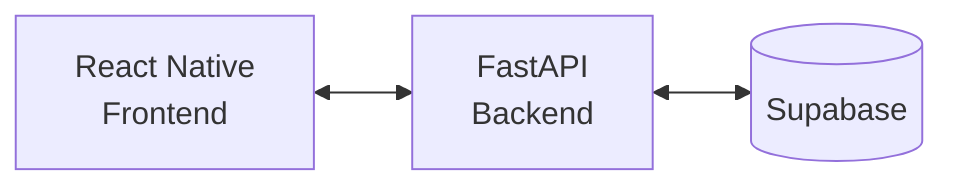

# Teto Justo


O **Teto Justo** é um aplicativo para organizar a convivência em casas
compartilhadas. A plataforma permite cadastrar casas e seus moradores, criar e
atribuir tarefas, além de acompanhar as sessões e responsabilidades de cada
pessoa — tornando a divisão das atividades do lar mais clara e justa.

## Protótipo

O fluxo e as telas do aplicativo estão disponíveis no
[Figma](https://www.figma.com/design/xMTN0YQQvJrjXXuPWrQhMr/Untitled?node-id=0-1&t=9VOn0ieYSl2Ssmk3-1).

## Tecnologias

- **Frontend:** React Native, Expo, Expo Router e TypeScript.
- **Backend:** Python, FastAPI, Pydantic e Uvicorn.
- **Dados:** Supabase.
- **Qualidade:** ESLint, Prettier, Ruff, Bandit e Pytest.
- **Containerização:** Docker e Docker Compose.

## Arquitetura



O app React Native consome a API FastAPI, que concentra as regras de negócio e
acessa o Supabase para persistir os dados.

## Como rodar localmente

### Pré-requisitos

- Node.js e npm;
- Python 3;
- Uma instância/projeto Supabase com as variáveis de acesso;
- Opcionalmente, Docker e Docker Compose para executar o backend em container.

### 1. Configure as variáveis de ambiente

Crie um arquivo `.env` na raiz do projeto com as credenciais do seu projeto
Supabase:

```env
SUPABASE_URL=https://seu-projeto.supabase.co
SUPABASE_KEY=sua-chave-do-supabase
```

Não versione esse arquivo nem exponha as credenciais.

### 2. Inicie o backend

Em um terminal, execute:

```powershell
cd src/backend
python -m venv venv
.\venv\Scripts\Activate.ps1
pip install -r requirements.txt
uvicorn main:app --reload
```

A API ficará disponível em `http://127.0.0.1:8000`. Para confirmar que está
ativa, acesse `http://127.0.0.1:8000/health`.

Como alternativa, a partir da raiz do repositório, execute o backend com
Docker:

```powershell
docker compose up --build backend
```

### 3. Inicie o frontend

Em outro terminal, execute:

```powershell
cd src/frontend
npm install
npm start
```

Use o Expo Go no dispositivo ou escolha o destino oferecido pelo Expo. Para
executar no navegador, use `npm run web`.

## Contexto do projeto

A pasta [`contexto/`](./contexto/) reúne resumos técnicos organizados por
sprint. Esses documentos registram o objetivo de cada entrega, os arquivos e
comportamentos alterados, decisões importantes, validações executadas e
pendências reais.

Ao concluir uma alteração no repositório, crie ou atualize o resumo
correspondente em `contexto/sprint_N/`. Prefira um nome curto e descritivo para
o arquivo, como `autenticacao.md` ou `testes_sessao.md`, e evite incluir
credenciais ou outras informações sensíveis.

## Qualidade de código

### Backend: Ruff

O projeto usa o **Ruff** para linting e formatação do código Python. Na pasta
`src/backend`, crie e ative o ambiente virtual caso ainda não o tenha feito:

```powershell
python -m venv venv
.\venv\Scripts\Activate.ps1
pip install ruff
```

> **Nota:** após a ativação, o terminal deve mostrar `(venv)` no início da
> linha.

> **Aviso no PowerShell:** se a ativação do ambiente for bloqueada pela
> política de execução, libere scripts apenas para o terminal atual e tente
> novamente:
>
> ```powershell
> Set-ExecutionPolicy -Scope Process -ExecutionPolicy RemoteSigned
> ```

Com o ambiente ativo, utilize:

```powershell
# Verifica problemas de estilo e código
ruff check .

# Corrige automaticamente o que for possível
ruff check --fix .

# Formata o código
ruff format .
```

As regras estão definidas em `src/backend/pyproject.toml`.

### Backend: Bandit (SAST)

O **Bandit** realiza análise estática de segurança no código Python. Instale-o
no ambiente virtual e execute a varredura a partir de `src/backend`:

```powershell
pip install bandit
bandit -r . -x ./venv,./tests
```

O parâmetro `-r` analisa os arquivos recursivamente e `-x` exclui o ambiente
virtual e os testes. Dê atenção especial aos achados com gravidade `High` ou
`Medium` antes de enviar alterações para produção.

### Boas práticas

Antes de criar um commit, siga este fluxo no backend:

1. Execute `ruff check .` para identificar problemas de código.
2. Execute `ruff check --fix .` quando houver correções automáticas
   disponíveis e revise as alterações geradas.
3. Execute `ruff format .` para manter a formatação consistente.
4. Execute `bandit -r . -x ./venv,./tests` para verificar vulnerabilidades
   conhecidas no código Python.
5. Corrija ou avalie os alertas relevantes antes de enviar as alterações.

Para sair do ambiente virtual ao encerrar o trabalho, execute `deactivate`.

### Frontend

```powershell
npm run lint
```
